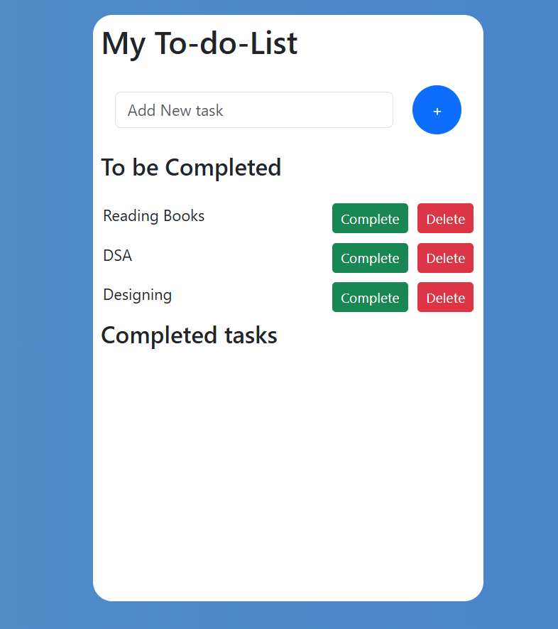

# React To-Do List App ✅

This is a simple To-Do List application built with **React**.  
It lets you keep track of tasks, mark them as completed, and delete them when done.  

---

## ✨ Features
- Add new tasks
- Mark tasks as completed
- Delete tasks
- See tasks in two sections:
  - To be Completed
  - Completed Tasks

---

## 📸 Screenshots


(./src/Components/image.png)

---

## 🛠️ Tech Stack
- React
- JavaScript
- CSS

---

## 🚀 How to Run Locally
1. Clone this repo:
   ```bash
   git clone https://github.com/your-username/react-todo-app.git
